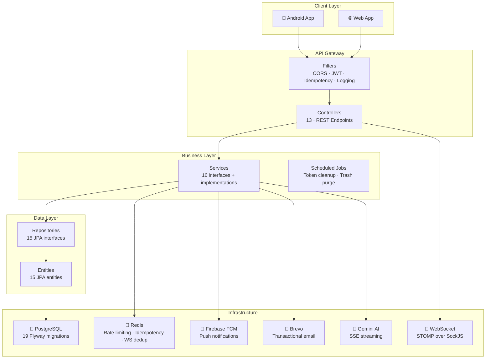
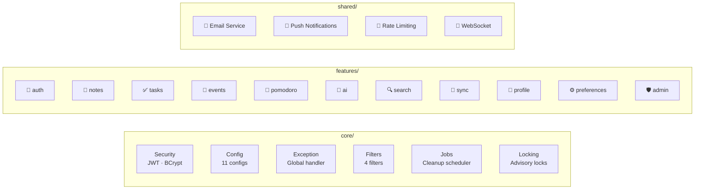
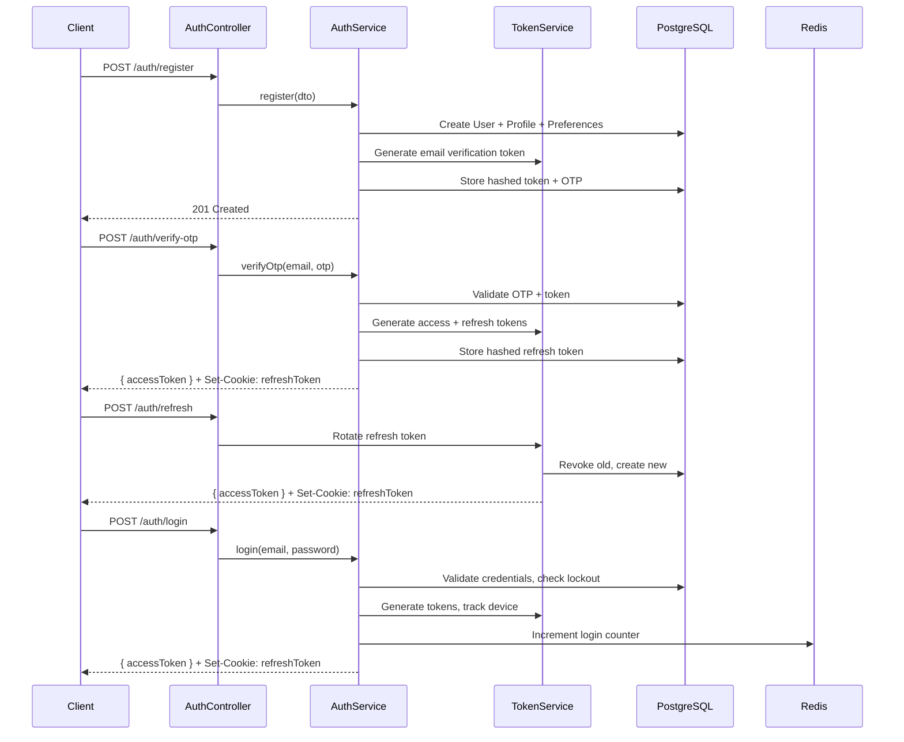
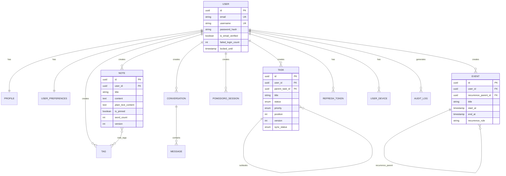
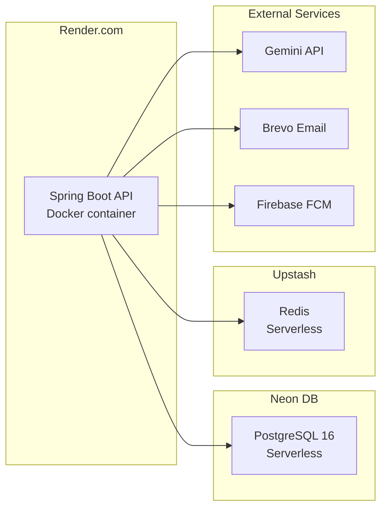

<div align="center">


# ProductivityX Backend

**Production-grade REST API powering the ProductivityX ecosystem**

[](https://spring.io/projects/spring-boot)
[](https://openjdk.org/projects/jdk/21/)
[](https://www.postgresql.org/)
[](https://redis.io/)
[](LICENSE)
[](#api-documentation)

[Deployed API](https://productivityx-backend.onrender.com) · [Android](https://github.com/productivityx-app/productivityx_android) · [Web](https://github.com/productivityx-app/productivityx_web)

</div>

---

## Overview

ProductivityX Backend is the central API server that powers the entire ProductivityX ecosystem. Built with **Spring Boot 4.0** on **Java 21**, it follows a **feature-based modular monolith** architecture where each domain module (auth, notes, tasks, events, pomodoro, AI, sync) is a self-contained vertical slice with its own controllers, services, repositories, entities, and DTOs.

This API handles everything from JWT authentication with token rotation and multi-device tracking, to real-time WebSocket push notifications, AI-powered chat via Gemini SSE streaming, offline-first delta synchronization, and Redis-backed rate limiting and idempotency — all backed by PostgreSQL with Flyway-managed migrations.

---

## Architecture



### Feature-Based Modular Structure



---

## Security

| Measure | Implementation |
|---|---|
| **Authentication** | JWT (access + refresh tokens). Access token in response body, refresh token in HttpOnly Secure cookie. |
| **Token rotation** | Every refresh call rotates the refresh token. Old token revoked immediately — no replay possible. |
| **Password hashing** | BCrypt with cost factor **12**. Minimum 8 chars with uppercase, lowercase, number, and special character. |
| **Token storage** | All token values (refresh, email verification, password reset) are **SHA-256 hashed** before DB storage — plain values are never persisted. |
| **Brute-force protection** | Account locks after 5 failed login attempts for 15 minutes. `failed_login_count` tracked per user. |
| **Rate limiting** | Redis-backed: login (5/15min per IP), resend verification (3/10min per user), OTP verification (5/15min). |
| **Idempotency** | Redis-backed idempotency filter for POST/PUT/PATCH/DELETE with `Idempotency-Key` header (24h TTL). |
| **CORS** | Configurable via `ALLOWED_ORIGINS` env var. Credentials allowed, 3600s max-age. |
| **CSRF** | Disabled (stateless API with JWT, no session cookies). |
| **User enumeration prevention** | Forgot password always returns 200 regardless of email existence. |
| **API key security** | Gemini API key is server-only — never exposed in any client response. |
| **Request tracing** | Every request gets a unique `X-Request-ID` for log correlation. |

---

## Authentication Lifecycle



---

## API Endpoints

**Base URL:** `/api/v1` · **Envelope:** `{ "success": true, "data": {}, "message": "...", "timestamp": "..." }`

### Authentication — `/api/v1/auth`

| Method | Endpoint | Description |
|---|---|---|
| `POST` | `/register` | Create account · sends verification email with OTP + magic link |
| `GET` | `/verify-email` | Verify email via magic link (browser redirect) |
| `POST` | `/verify-email` | Verify email via magic link (API) |
| `POST` | `/verify-otp` | Verify email via 6-digit OTP |
| `POST` | `/resend-verification` | Resend verification (rate-limited: 3/10min) |
| `POST` | `/login` | Login · returns accessToken + sets refreshToken HttpOnly cookie |
| `POST` | `/refresh` | Rotate refresh token · return new accessToken |
| `POST` | `/logout` | Revoke refresh token · clear cookie |
| `POST` | `/forgot-password` | Request password reset email (always returns 200) |
| `POST` | `/verify-forgot-otp` | Verify password-reset OTP · get short-lived resetToken |
| `POST` | `/reset-password` | Reset password using token from email or OTP flow |
| `POST` | `/change-password` | Change password (authenticated, requires current password) |
| `GET` | `/me` | Get current user's full profile and account info |
| `DELETE` | `/account` | Permanently delete account (requires password confirmation) |

### Notes — `/api/v1/notes`

| Method | Endpoint | Description |
|---|---|---|
| `POST` | `/` | Create a new note |
| `GET` | `/` | List active notes (filterable by tagId, pinned) |
| `GET` | `/{id}` | Get a single note |
| `GET` | `/trash` | List soft-deleted notes |
| `PUT` | `/{id}` | Update a note (partial) |
| `PATCH` | `/{id}/pin` | Pin a note |
| `PATCH` | `/{id}/unpin` | Unpin a note |
| `DELETE` | `/{id}` | Soft-delete a note |
| `PATCH` | `/{id}/restore` | Restore note from trash |
| `DELETE` | `/{id}/permanent` | Permanently delete a trashed note |
| `POST` | `/{id}/tags` | Add a tag to a note |
| `DELETE` | `/{id}/tags/{tagId}` | Remove a tag from a note |

### Tasks — `/api/v1/tasks`

| Method | Endpoint | Description |
|---|---|---|
| `POST` | `/` | Create a task or subtask |
| `GET` | `/` | List tasks (paginated, filterable by status/priority/parentId) |
| `GET` | `/trash` | List trashed tasks |
| `GET` | `/{id}` | Get a single task with subtasks |
| `PUT` | `/{id}` | Full update of a task |
| `PATCH` | `/{id}/status` | Update task status (auto manages completedAt) |
| `PATCH` | `/reorder` | Bulk reorder tasks (kanban drag-and-drop) |
| `PATCH` | `/{id}/restore` | Restore task from trash |
| `DELETE` | `/{id}` | Soft-delete task |
| `DELETE` | `/{id}/permanent` | Permanently delete a trashed task |

### Events — `/api/v1/events`

| Method | Endpoint | Description |
|---|---|---|
| `POST` | `/` | Create calendar event (supports recurrence RRULE) |
| `GET` | `/` | List events (range query with from/to, or paged) |
| `GET` | `/{id}` | Get a single event |
| `GET` | `/trash` | List trashed events |
| `PUT` | `/{id}` | Update an event |
| `DELETE` | `/{id}` | Soft-delete an event |
| `PATCH` | `/{id}/restore` | Restore event from trash |
| `DELETE` | `/{id}/permanent` | Permanently delete a trashed event |
| `DELETE` | `/{id}/series` | Delete all instances of a recurring series |

### Pomodoro — `/api/v1/pomodoro`

| Method | Endpoint | Description |
|---|---|---|
| `POST` | `/sessions/start` | Start a new Pomodoro session |
| `PATCH` | `/sessions/{id}/end` | End (complete) an active session |
| `PATCH` | `/sessions/{id}/interrupt` | Interrupt (stop early) an active session |
| `GET` | `/sessions/active` | Get the currently active session |
| `GET` | `/sessions/{id}` | Get a single session |
| `GET` | `/sessions` | List session history (filterable by taskId) |
| `GET` | `/stats/today` | Get today's Pomodoro stats |

### AI — `/api/v1/ai`

| Method | Endpoint | Description |
|---|---|---|
| `GET` | `/models` | List all supported AI models |
| `GET` | `/conversations` | List all conversations (newest first) |
| `POST` | `/conversations` | Create a new empty conversation |
| `GET` | `/conversations/{id}` | Get conversation with full message history |
| `DELETE` | `/conversations/{id}` | Archive a conversation |
| `POST` | `/conversations/{id}/messages` | Send message · receive SSE stream |

### Other Endpoints

| Resource | Endpoint | Description |
|---|---|---|
| **Tags** | `GET/POST /tags`, `PUT/DELETE /tags/{id}` | Full CRUD for note tags |
| **Profile** | `GET/PUT /profile`, `PATCH /profile/avatar` | Profile management |
| **Preferences** | `GET/PUT /preferences` | User preferences |
| **Search** | `GET /search?q=&types=&limit=` | Full-text search across notes, tasks, events |
| **Sync** | `GET /sync/delta?since=&cursor=&limit=` | Cursor-paginated delta sync |
| **Devices** | `GET /devices`, `DELETE /devices/{id}`, `PATCH /devices/{id}/push-token` | Multi-device management |
| **Admin** | `POST /admin/cleanup` | Manual tombstone cleanup (ADMIN role) |
| **Health** | `GET /actuator/health` | Application health check |

---

## Project Statistics

<table>
  <tr>
    <td align="center"><b>~9,670</b><br/>Lines of Code</td>
    <td align="center"><b>176</b><br/>Java Files</td>
    <td align="center"><b>13</b><br/>Controllers</td>
    <td align="center"><b>16</b><br/>Services</td>
  </tr>
  <tr>
    <td align="center"><b>15</b><br/>Repositories</td>
    <td align="center"><b>15</b><br/>Entities</td>
    <td align="center"><b>47</b><br/>DTOs</td>
    <td align="center"><b>58</b><br/>API Endpoints</td>
  </tr>
  <tr>
    <td align="center"><b>19</b><br/>Flyway Migrations</td>
    <td align="center"><b>11</b><br/>Configs</td>
    <td align="center"><b>4</b><br/>Filters</td>
    <td align="center"><b>15</b><br/>DB Entities</td>
  </tr>
</table>

| Metric | Value |
|---|---|
| **Language** | Java 21 (Kotlin plugin available, 0 .kt files) |
| **Framework** | Spring Boot 4.0.0 |
| **Total Java files** | 176 |
| **Lines of code** | +10k |
| **Controllers** | 13 |
| **Service interfaces** | 16 |
| **Service implementations** | 16 |
| **Repository interfaces** | 15 |
| **JPA Entities** | 15 |
| **DTO classes** | 47 |
| **Configuration classes** | 11 |
| **Servlet filters** | 4 |
| **Enums** | 12 |
| **Flyway migrations** | 19 (V1 → V19) |
| **REST API endpoints** | 58 |
| **WebSocket topics** | 4 |
| **Scheduled jobs** | 2 (token cleanup, trash purge) |

---

## Database

### Entity Relationship



### Database Tables (15)

| Table | Description |
|---|---|
| `users` | User credentials, email verification, account lockout |
| `profiles` | First/last name, avatar, bio, timezone, language, theme |
| `user_preferences` | Pomodoro settings, notifications, defaults, AI config |
| `tasks` | Tasks with subtasks, status, priority, position, versioning |
| `events` | Calendar events with recurrence, all-day, color, reminders |
| `notes` | Rich text notes with word count, reading time, pinning |
| `tags` | Note tags with user scoping and color |
| `note_tags` | Many-to-many junction table |
| `pomodoro_sessions` | Session lifecycle with settings snapshot |
| `conversations` | AI conversation threads |
| `messages` | AI messages with action blocks (JSONB) |
| `refresh_tokens` | Device-bound refresh tokens (hashed) |
| `email_verification_tokens` | OTP + magic link tokens |
| `password_reset_tokens` | Password reset OTP + tokens |
| `user_devices` | Multi-device tracking with push tokens |
| `audit_logs` | Auth event audit trail |

### Migrations (19)

| Version | Description |
|---|---|
| V1–V6 | Core tables: users, tokens, profiles, preferences |
| V7–V9 | Notes: tags, notes, note_tags junction |
| V10–V12 | Tasks, events, pomodoro sessions |
| V13–V14 | AI: conversations, messages |
| V15 | Audit logs |
| V16 | Updated_at triggers |
| V17 | Optimistic locking and conflict fields |
| V18 | Performance indexes |
| V19 | User devices |

---

## Technology Stack

| Layer | Technology | Version |
|---|---|---|
| **Framework** | Spring Boot | 4.0.0 |
| **Language** | Java | 21 LTS |
| **Security** | Spring Security + JJWT | 4.0.0 / 0.12.6 |
| **ORM** | Spring Data JPA + Hibernate | 4.0.0 |
| **Database** | PostgreSQL | 16 (Neon DB) |
| **Migrations** | Flyway | 10.22.0 |
| **Cache / Rate Limiting** | Redis + Lettuce | Spring Boot BOM |
| **Real-time** | Spring WebSocket + STOMP | 4.0.0 |
| **Search** | PostgreSQL FTS (tsvector + GIN) | — |
| **AI Proxy** | Gemini REST via OkHttp | 4.12.0 |
| **Email** | Brevo (Sendinblue) | — |
| **Push Notifications** | Firebase Cloud Messaging | 9.4.3 |
| **API Docs** | SpringDoc OpenAPI | 2.8.8 |
| **Validation** | Jakarta Validation | 4.0.0 |
| **Actuator** | Spring Boot Actuator | 4.0.0 |
| **Build** | Gradle | 9.3.1 |
| **Testing** | JUnit 5 + Testcontainers | 1.20.4 |
| **OWASP** | Dependency Check | 9.0.9 |
| **Code Quality** | SonarQube | 5.1.0.4882 |

---

## Folder Structure

```
src/main/java/com/oussama_chatri/productivityx/
├── ProductivityXApplication.java
│
├── core/                                # Shared infrastructure
│   ├── audit/                           # AuditLog entity + AuditService
│   ├── config/                          # 11 @Configuration classes
│   │   ├── SecurityConfig.java          # JWT filter chain, BCrypt, CORS
│   │   ├── RedisConfig.java             # Lettuce connection
│   │   ├── JpaConfig.java              # Hibernate, batch, UTC timezone
│   │   ├── FlywayConfig.java           # Migration configuration
│   │   ├── WebSocketConfig.java        # STOMP + SockJS
│   │   ├── OpenApiConfig.java          # Swagger UI
│   │   ├── AsyncConfig.java            # Thread pool
│   │   ├── WebMvcConfig.java           # CORS, interceptors
│   │   ├── JacksonConfig.java          # JSON serialization
│   │   ├── FirebaseConfig.java         # FCM setup
│   │   └── BrevoConfig.java            # Email client
│   ├── dto/                             # ApiResponse, PagedResponse
│   ├── enums/                           # 12 enumerations
│   ├── exception/                       # Global exception handler, error codes
│   ├── filter/                          # JWT, CORS, Idempotency, RequestLogging
│   ├── jobs/                            # Token cleanup, trash purge
│   ├── locking/                         # PostgreSQL advisory locks
│   ├── security/                        # JwtService, JwtAuthFilter
│   ├── user/                            # User entity + UserRepository
│   └── util/                            # Crypto, Pageable, Security, Validation utils
│
├── features/                            # Feature modules (controller/service/repo/entity/dto)
│   ├── auth/                            # 14 auth endpoints + device management
│   ├── notes/                           # Notes CRUD + tags + merge + trash purge
│   ├── tasks/                           # Tasks CRUD + subtasks + reorder + trash purge
│   ├── events/                          # Events CRUD + recurrence + trash purge
│   ├── pomodoro/                        # Session lifecycle + stats
│   ├── ai/                              # Gemini SSE streaming + conversation persistence
│   ├── profile/                         # Profile management
│   ├── preferences/                     # User preferences
│   ├── search/                          # Full-text search
│   ├── sync/                            # Delta sync endpoint
│   └── admin/                           # Cleanup trigger (ADMIN role)
│
└── shared/                              # Cross-cutting services
    ├── email/                           # EmailService + EmailTemplates (Brevo)
    ├── push/                            # FcmService
    ├── ratelimit/                       # RateLimiterService (Redis)
    └── websocket/                       # WebSocketNotifier

src/main/resources/
├── application.properties               # Base configuration
├── application-dev.properties           # Dev profile (Neon DB, Swagger)
└── db/migration/                        # 19 Flyway SQL migrations (V1–V19)
```

---

## Infrastructure

### Docker

**Multi-stage Dockerfile:**

```dockerfile
# Stage 1: Build
FROM eclipse-temurin:21-jdk-alpine AS build
WORKDIR /app
COPY . .
RUN ./gradlew clean bootJar --no-daemon -x test

# Stage 2: Runtime
FROM eclipse-temurin:21-jre-alpine
WORKDIR /app
COPY --from=build /app/build/libs/*.jar app.jar
EXPOSE 8080
ENTRYPOINT ["java", \
  "-XX:+UseContainerSupport", \
  "-XX:MaxRAMPercentage=75.0", \
  "-Djava.security.egd=file:/dev/./urandom", \
  "-jar", "app.jar"]
```

### Deployment



---

## Environment Variables

```env
# Database
DATABASE_URL=jdbc:postgresql://<host>:5432/productivityx?sslmode=require
DATABASE_USERNAME=<user>
DATABASE_PASSWORD=<password>

# Redis
REDIS_URL=rediss://:password@<host>.upstash.io:6380

# JWT
JWT_SECRET=<minimum 64 random characters>
JWT_ACCESS_EXPIRY_MS=900000
JWT_REFRESH_EXPIRY_DAYS=7

# Gemini AI
GEMINI_API_KEY=<your-api-key>
GEMINI_MODEL=gemini-3.5-flash

# Email (Brevo)
BREVO_API_KEY=<your-brevo-api-key>
BREVO_SENDER_EMAIL=noreply@productivityx.app

# Firebase
FIREBASE_ENABLED=false

# App
SERVER_PORT=8080
SPRING_PROFILES_ACTIVE=dev
APP_BASE_URL=http://localhost:8080
APP_FRONTEND_URL=http://localhost:5173
APP_DEEP_LINK_BASE_URL=productivityx://auth
ALLOWED_ORIGINS=http://localhost:3000,http://localhost:8081
```

---

## Getting Started

### Prerequisites

- JDK 21
- Docker (for local PostgreSQL + Redis)

### Local Development

```bash
# 1. Start local infrastructure
docker compose -f docker-compose.dev.yml up -d

# 2. Run with dev profile
./gradlew bootRun --args='--spring.profiles.active=dev'
```

**docker-compose.dev.yml:**

```yaml
services:
  postgres:
    image: postgres:16-alpine
    environment:
      POSTGRES_DB: productivityx
      POSTGRES_USER: dev
      POSTGRES_PASSWORD: dev
    ports: ["5432:5432"]
    volumes: [pgdata:/var/lib/postgresql/data]
  redis:
    image: redis:7-alpine
    ports: ["6379:6379"]
volumes:
  pgdata:
```

### API Documentation

| Resource | URL |
|---|---|
| **Swagger UI** | `http://localhost:8080/swagger-ui.html` |
| **Health Check** | `http://localhost:8080/actuator/health` |

> Swagger UI is enabled in dev profile, disabled in production.

### Docker Build

```bash
./gradlew bootJar
docker build -t productivityx-backend .
docker run -p 8080:8080 --env-file .env productivityx-backend
```

---

## Testing

```bash
./gradlew test
```

Integration tests use **Testcontainers** — real PostgreSQL and Redis instances spin up automatically. No manual infrastructure setup needed for tests.

---

## Roadmap

- [ ] Comprehensive integration test suite
- [ ] OpenAPI spec export for client generation
- [ ] WebSocket presence/typing indicators
- [ ] Batch operations endpoint
- [ ] File upload/storage service (S3-compatible)
- [ ] Admin dashboard API
- [ ] Rate limit headers in responses
- [ ] GraphQL subscription support
- [ ] Distributed tracing (OpenTelemetry)
- [ ] Horizontal scaling with shared Redis sessions

---

## License

This project is licensed under the **Non-Commercial Source Available License**.

You may view, study, learn from, and modify the source code for personal, educational, research, and evaluation purposes. **Commercial use is strictly prohibited** without prior written permission.

See [LICENSE](LICENSE) for full details.

---

<div align="center">

**Built with precision by [Oussama Chatri](https://github.com/osamachatri)**

[ProductivityX](https://github.com/productivityx-app) · [Android](https://github.com/productivityx-app/productivityx_android) · [Backend](https://github.com/productivityx-app/productivityx_backend) · [Web](https://github.com/productivityx-app/productivityx_web)

</div>
